# Penetration Test — Linux Target (Team Project)

**Team project (OAK Academy, Batch 13 – Group 1)** — full-cycle penetration test against an Ubuntu 22.04.1 LTS training target, covering reconnaissance, exploitation, privilege escalation, credential recovery, and authenticated vulnerability scanning.

`Penetration Testing` `OWASP` `PTES` `Metasploit` `Nmap` `Nessus` `Privilege Escalation` `Password Cracking` `CVE-2014-6271 (Shellshock)` `Vulnerability Reporting`

> **Note:** This was a graded team exercise against a training lab environment. Specific flag values, cracked credentials, and lab login details have intentionally been left out of this summary — the write-up below focuses on methodology and findings, not a step-by-step solve guide.

---

## Scope & Methodology

| Item | Detail |
|---|---|
| **Target** | Ubuntu 22.04.1 LTS, Kernel 5.15.0-67 |
| **Methodology** | OWASP + PTES (Penetration Testing Execution Standard) |
| **Out of scope** | Social engineering, physical security testing, DoS/DDoS, out-of-scope IPs |
| **Objective** | Gain remote access, escalate to root, crack recovered credentials, and validate findings with a credentialed vulnerability scan |

## Attack Phases

| Phase | Actions | Outcome |
|---|---|---|
| **1. Reconnaissance** | Nmap port/service scan, unauthenticated Nessus scan, anonymous FTP enumeration to read exposed files and identify hints toward the attack vector | Attack surface mapped; initial vector identified |
| **2. Initial Access** | Two candidate web-service vectors were identified (Apache Shellshock and a Tomcat weak-credential path); exploited **Shellshock (CVE-2014-6271)** via Metasploit to gain remote code execution as `www-data`, establishing a Meterpreter session | Low-privilege shell access confirmed; first flag (`user.txt`) retrieved |
| **3. Privilege Escalation** | Ran `local_exploit_suggester`, tested DirtyPipe and `pkexec` (unsuccessful), then enumerated SUID binaries and found a misconfigured SUID bit | Escalated from `www-data` to full **root** access; second flag (`root.txt`) retrieved |
| **4. Post-Exploitation & Cracking** | Extracted `/etc/shadow` as root, retrieved a provided wordlist, cracked the `oak_user` account password offline with **John the Ripper** | Live credential recovered (value withheld) |
| **5. Credentialed Scan** | Returned to Nessus and ran a new scan against the target using the recovered `oak_user` credentials | Authenticated scan surfaced internal risks (missing patches, kernel vulnerabilities) invisible to the earlier external scan |
| **6. Reporting** | Compiled a professional report: Executive Summary, Vulnerability Details (per-finding severity and evidence), and Remediation recommendations | Delivered as the team's final deliverable |

## Attack Narrative (Screenshots)

### Reconnaissance

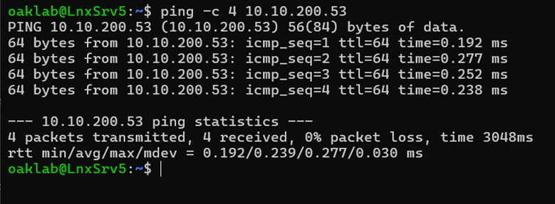

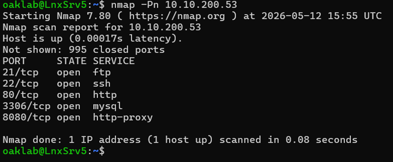

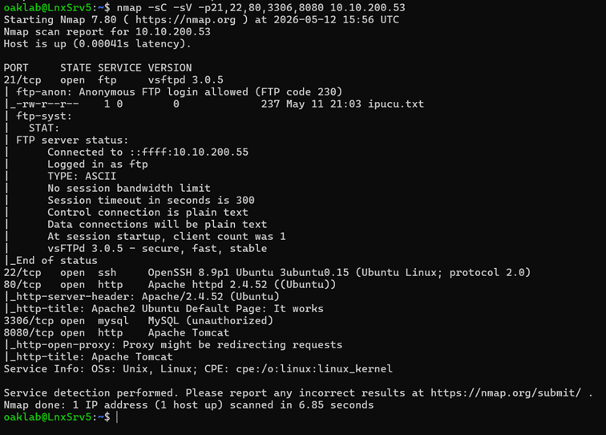

### FTP Enumeration

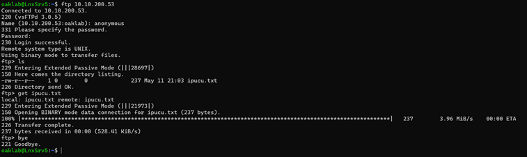

### Vulnerability Scanning (Nessus)

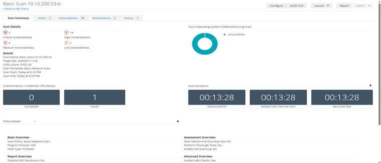

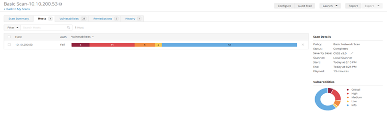

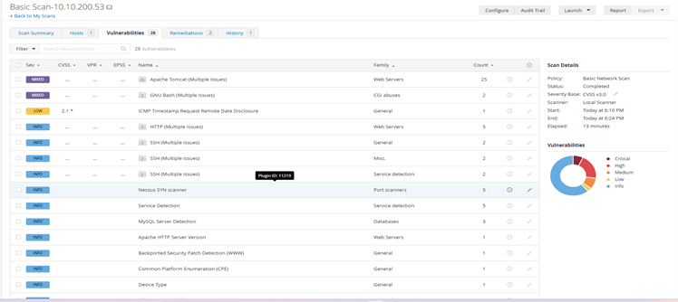

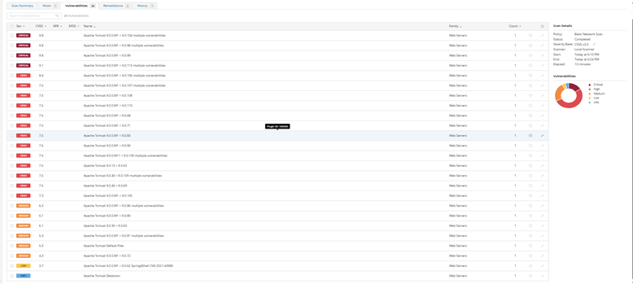

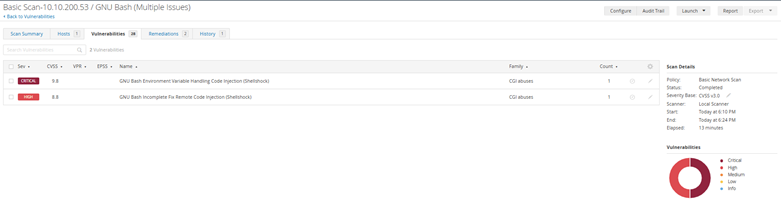

### Initial Access

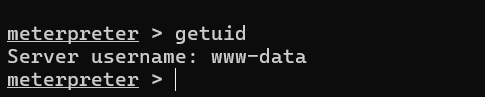

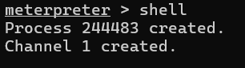

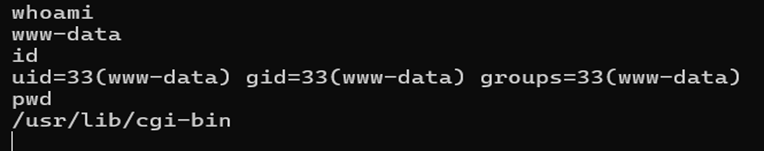

### Privilege Escalation

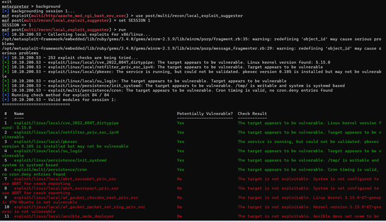
*Methodical approach: several candidate exploits (CVE-2022-0847 DirtyPipe, pkexec, su_login, and others) were identified and tested in turn.*

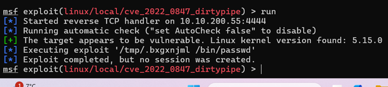

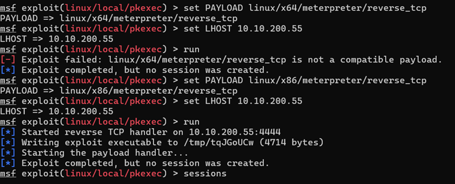
*Not every attempt succeeds — trial and error against multiple candidate paths is part of the real process.*

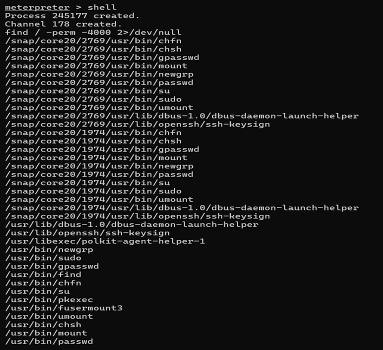
*Manual enumeration of SUID binaries — identified a misconfigured SUID bit on `/usr/bin/find`, the path that led to successful privilege escalation (see Key Findings for details).*

### Credential Access

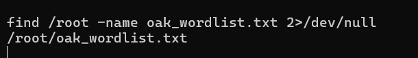

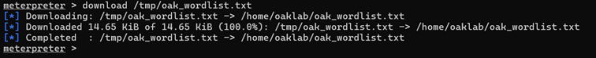

## Key Findings

| # | Severity | Finding | Impact |
|---|---|---|---|
| 1 | **Critical** | Remote code execution via Shellshock (CVE-2014-6271), followed by root access via SUID misconfiguration on `/usr/bin/find` | Full system compromise |
| 2 | **Critical** | Default/blank credentials exposed across multiple services (anonymous FTP, Tomcat manager, MySQL root with empty password) | Full service-level compromise |
| 3 | **Critical** | Nessus identified 66 missing Ubuntu OS/kernel updates, indicating a substantial patching backlog | Elevated risk of further remote exploitation |
| 4 | **High** | A user account password was crackable offline against a standard wordlist | Account compromise |
| 5 | **Medium** | Unnecessary services exposed to the network (MySQL on 3306, FTP) | Unauthorized database/service access |

## Unauthenticated vs. Credentialed Scan Comparison

| Severity | Unauthenticated | Credentialed | Difference |
|---|---|---|---|
| Critical | 5 | 7 | +2 |
| High | 14 | 53 | +39 |
| Medium | 6 | 9 | +3 |
| Low | 2 | 1 | −1 |
| **Total** | **28** | **70** | **+42** |

The difference reflects the additional visibility provided by authenticated checks; finding counts alone do not establish the number of unique vulnerabilities or their business risk.

Consistent with our separate [Vulnerability Assessment project](https://github.com/muazzez-gurbuz/vulnerability-assessment-nmap-nessus): credentialed scanning surfaced dramatically more — and more severe — findings than an external, unauthenticated view alone.

## Tools Used

Nmap · Metasploit Framework / Meterpreter · Nessus Professional · John the Ripper · Hashcat · Hashid · GTFOBins · FTP & MySQL clients · Exploit-DB

## Remediation Priorities (Summary)

- Patch Shellshock and all outstanding OS/kernel updates immediately
- Remove or correct the SUID bit on binaries that don't require it (`/usr/bin/find`)
- Eliminate default/blank credentials on all services (FTP, Tomcat, MySQL)
- Restrict unnecessary network-exposed services (e.g. MySQL should not be internet-facing)
- Enforce a stronger password policy to resist offline cracking

---

*Team project completed as part of OAK Academy's Cybersecurity Engineering program in a controlled, authorized training lab environment. Full findings, flag values, and recovered credentials are documented in the team's confidential internal report and are not reproduced here.*
